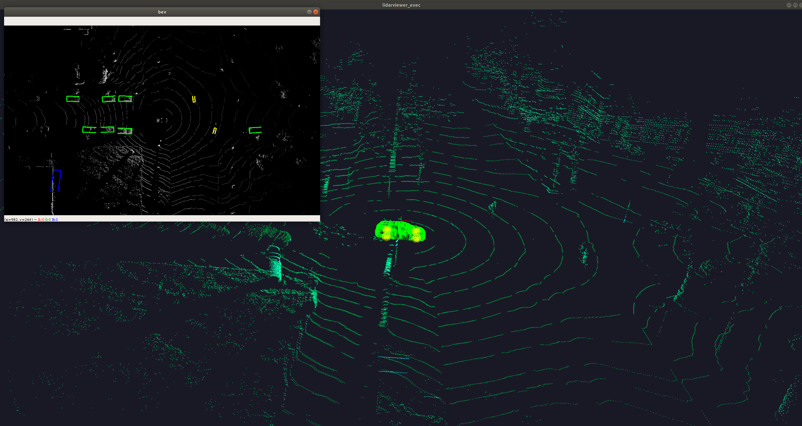
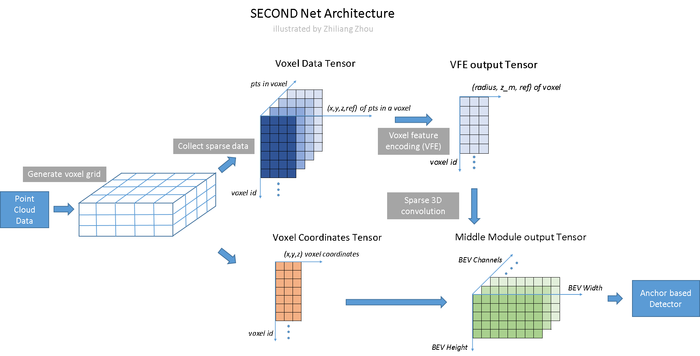
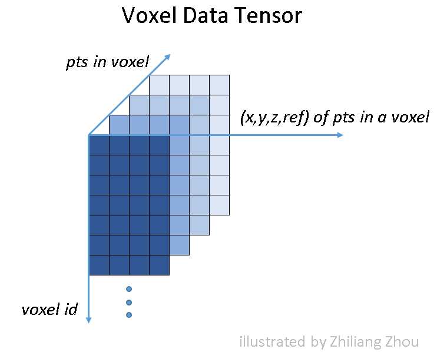
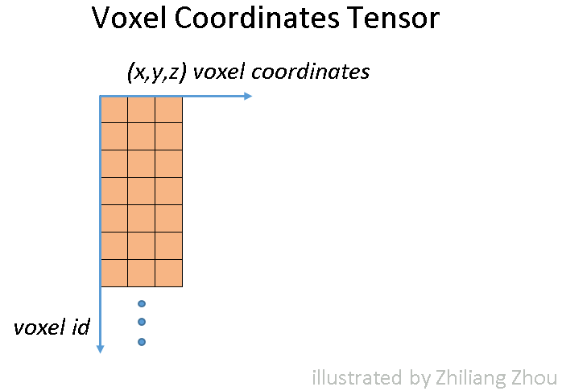
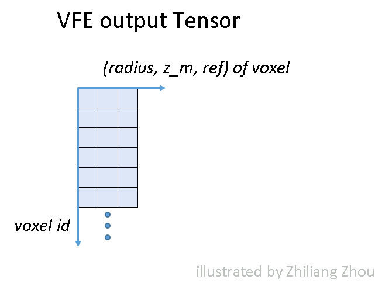
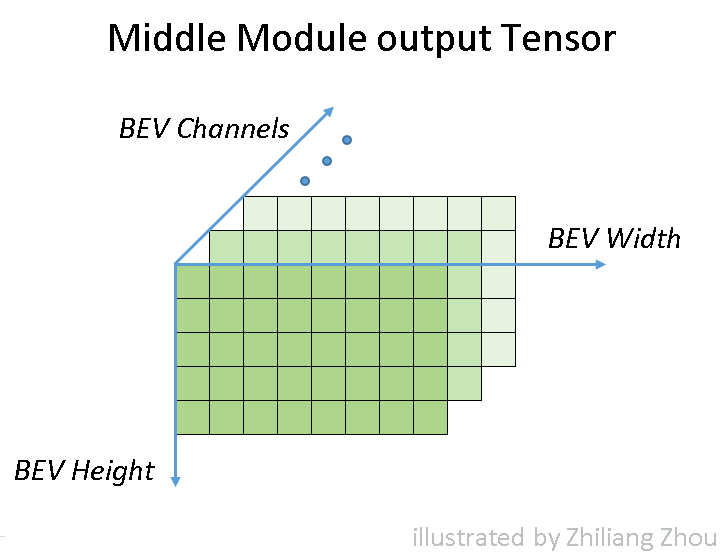

# 1. Introduction
simplified [SECOND](https://github.com/traveller59/second.pytorch) LiDAR object detection

my change:
* use own customized [spconv_lite](https://github.com/masszhou/spconv_lite) instead of [spconv](https://github.com/traveller59/spconv)
* rewrite/refactor code
* trained with kitti
* trained with lyft 3d detection (not included in this repo)
* add my own understanding and illustrations about the model
* test on a real testing car, 0.05 sec per Lidar frame, wth GTX 2080 (not included in this repo)

My results
* KITTI [2011-09-26-0005](https://youtu.be/p5ZlXYoMb5o)
* KITTI [2011 09 26 0023](https://youtu.be/fRAjDE7FdDQ)
* test on a real testing car
  * 3d visualization is my opengl 2.0 practice [repo](https://github.com/masszhou/lidarviewer)
  * results currently rendered in BEV, yellow is cyclist, defined in KITTI


# 2. SECOND lite Model Architecture


### 2.1 VFE module







### 2.2 middle conv3D module


### 2.3 RPN module

# 3. How to use

under root of this project
```
python -m script.predict_kitti predict_pcl_files --pcl_path="{kitti_root}/2011_09_26/2011_09_26_drive_0023_sync/velodyne_points/data/" --image_root_path="{kitti_root}/2011_09_26/2011_09_26_drive_0023_sync/image_02/data/" --save=True
```

# 4. Results on KITTI test set
training with 180° FOV labels, inference with 360° FOV
* green: car
* blue: van
* red: pedestrian
* yellow: cyclist

My results
* KITTI [2011-09-26-0005](https://youtu.be/p5ZlXYoMb5o)
* KITTI [2011 09 26 0023](https://youtu.be/fRAjDE7FdDQ)
